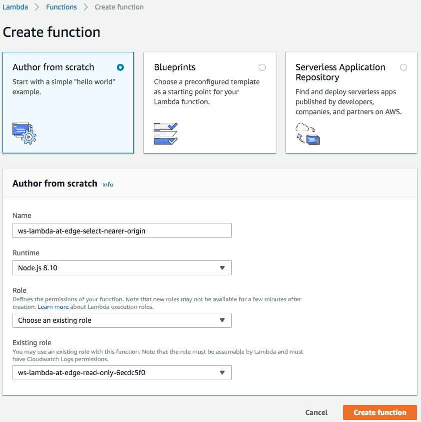
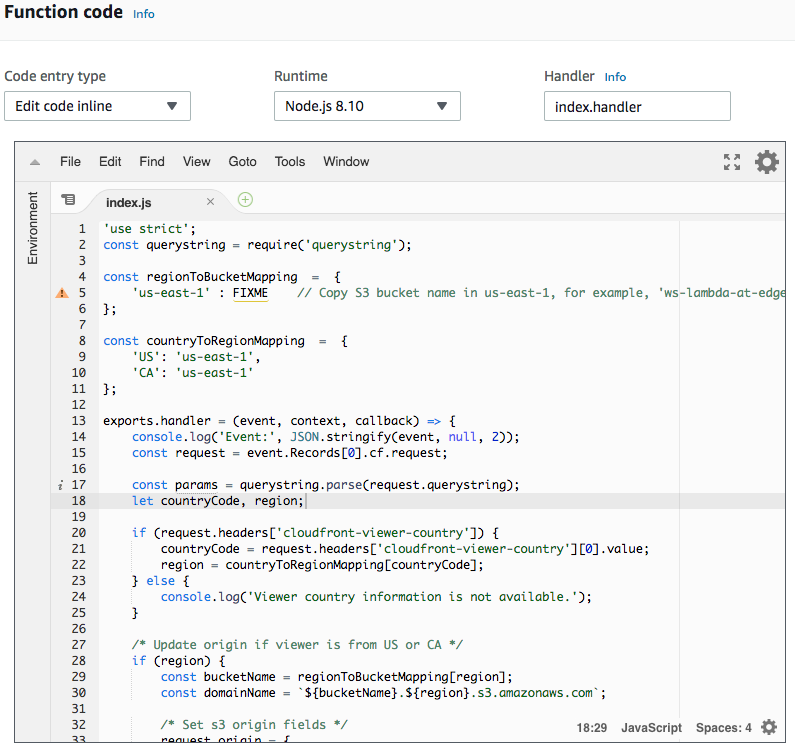
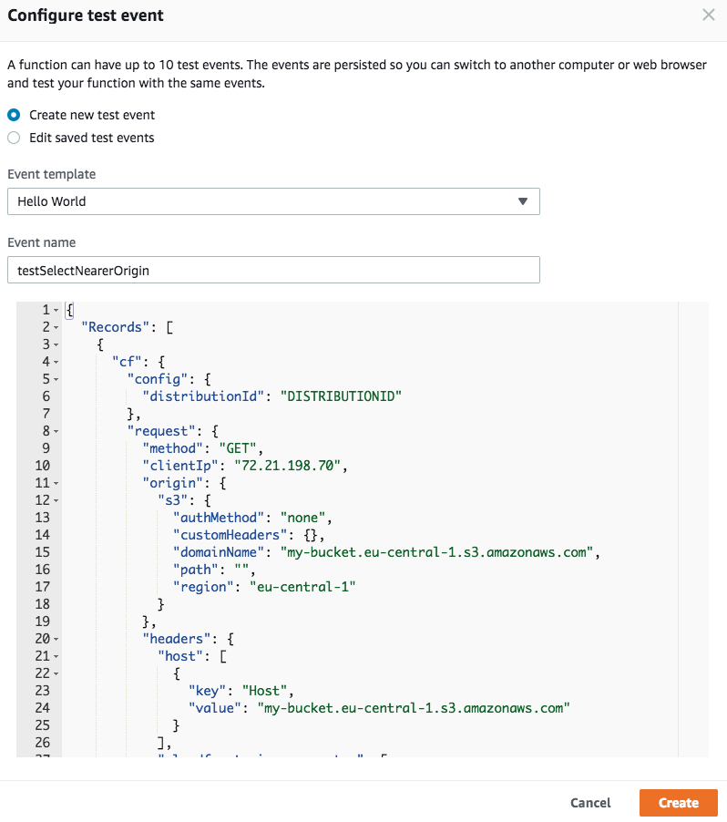
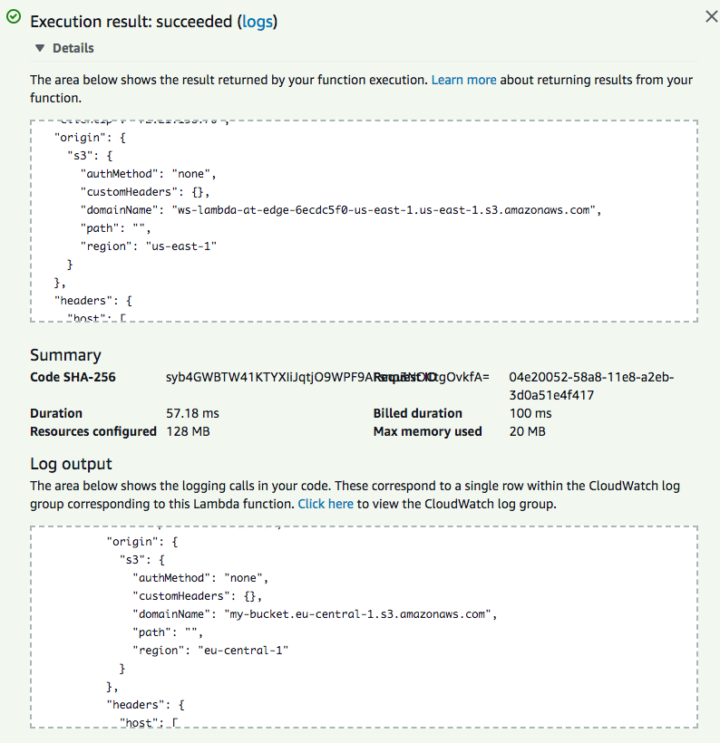
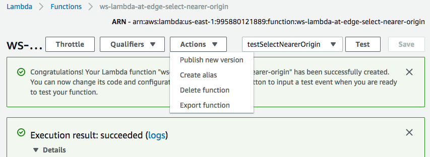
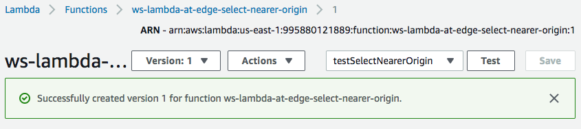
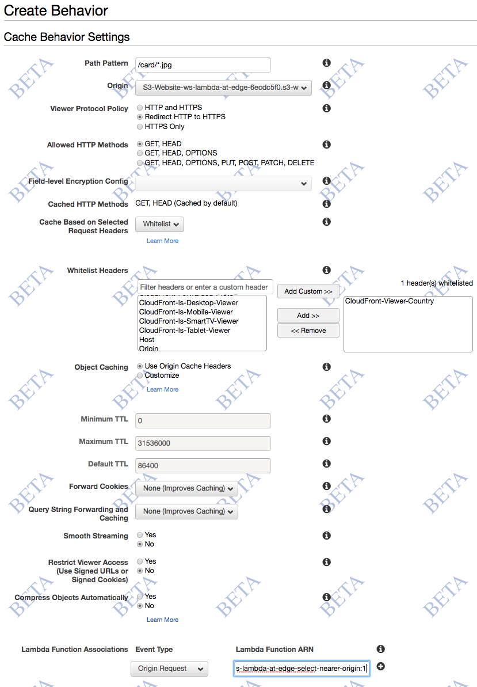
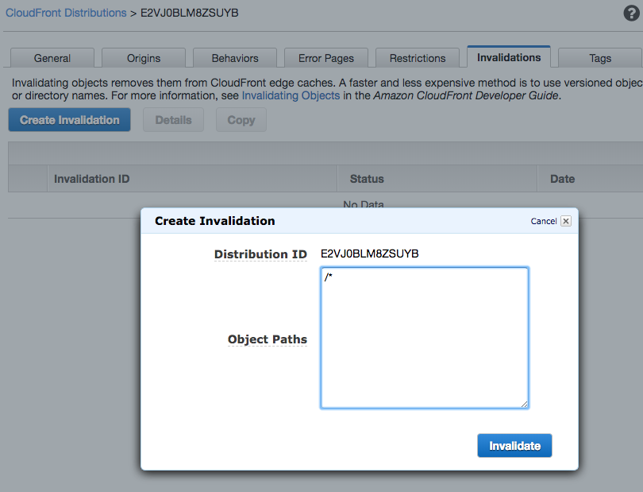

## Lab 6 - Origin Selection

With Lambda@Edge, besides modifying requests and responses by changing URIs, cookies, headers and query strings, you can also modify the origin in lambda function triggered by origin-request event. In this case, when there is a cache miss, instead of going to the configured origin, CloudFront will send request to origin updated in the origin-request event.

In this lab, you will learn how to create a Lambda function that changes S3 origin region based on country of the viewer to serve content from nearby region for lower latencies. 

**NOTE:** Here and below throughout the workshop, replace the example domain name `d123.cloudfront.net` with the unique name of your distribution.

Currently the images served by your CloudFront distribution, created by CloudFormation for this workshop, are read from an S3 bucket located in `eu-central-1`. 
Run the below curl command to send 10 requests to the Cloudfront distribution with `Cache-Control` header value as `cf-no-cache` so that the image is served from S3 origin instead of cache, and note down the average total time.
```
for i in {1..10}; do curl -v -w "time_total:%{time_total}\n" -o /dev/null -s -H "Cache-Control: cf-no-cache" "https://d123.cloudfront.net/card/960w/da8398f4.jpg"; done | grep time_total | awk -F ':' '{sum += $2; n++; print "Request: " n "  TotalTime: " $2} END {if (n > 0) print "==============================\nAverage Total Time: " sum/n"\n=============================="}'
```
As part of this lab, we will create a new lambda function which will inspect `CloudFront-Viewer-Country` header, set by Cloudfront, to find the country of the viewer and if the viewer is located in United States or Canada, origin is updated to bucket in `us-east-1` region. On completion of this lab, depending upon viewer country of the users of this lab, the average total time taken might change. For users in US and Canada, since `us-east-1` is nearer than `eu-central-1`, the average total time taken should certainly be lesser than what we saw with bucket in `eu-central-1`.

#### 1 Create a Lambda function

Similar to how we did it in the previous labs, create a Lambda function in "US East (N.Virginia)" region.

In the `Basic information` window, specify:
* `Name`: `ws-lambda-at-edge-select-nearer-origin`
* `Runtime`: `Node.js 6.10` or `Node.js 8.10`
* `Role`: `Choose an existing role`
* `Existing role`: `ws-lambda-at-edge-read-only-<UNIQUE_ID>` (this role allows the function to read data from the DynamoDB table and also get object from the S3 bucket)

Use JavaScript code from [ws-lambda-at-edge-select-nearer-origin.js](./ws-lambda-at-edge-select-nearer-origin.js) as a blueprint.





#### 2 Validate the function works in Lambda Console

Click `Save and Test` and configure the test event. Create new test event and use [ws-lambda-at-edge-select-nearer-origin-test-input.json](./ws-lambda-at-edge-select-nearer-origin-test-input.js) as a test input.



Execute the test-invoke and validate that function execution succeeds and the origin refers to a bucket in `us-east-1`.



#### 3 Publish a function version

Choose "Publish new version" under "Actions", specify an optional description of a function version and click "Publish".






#### 4 Create cache behavior for the images 

Jump to Cloudfront console and under the "Behaviors" tab, click "Create Behavior". Choose the following settings:
* Path Pattern: /card/*.jpg
* Viewer Protocol Policy: Redirect HTTP to HTTPS
* Cache Based on Selected Request Headers: Whitelist
* Whitelist Headers: Select `CloudFront-Viewer-Country` and click `Add >>`
* Lambda Function Associations: Origin Request = `<lambda version ARN from the previous step>`
* Click "Create"




#### 5 Wait for the change to propagate

After any modification of a CloudFront distribution, the change should be propagated globally to all CloudFront edge locations. The propagation status is indicated as "In Progress" and "Deployed" when it's complete. Usually ~30-60seconds is enough for the change to take effect, even though the status may be still "In Progress". To be 100% certain though you can wait until the change is fully deployed.

#### 6 Invalidate CloudFront cache

CloudFront may have already cached the old version home page, let's purge any stale objects from the cache. Submit a wildcard invalidation '/*'.



#### 7 The generated card details page is now fetching images from the nearer origin.

To verify the same; again run the curl command and for the users in US and Canada, average total time taken should be lesser than what we saw with S3 origin bucket in `eu-central-1` region.
```
for i in {1..10}; do curl -v -w "time_total:%{time_total}\n" -o /dev/null -s -H "Cache-Control: cf-no-cache" "https://d123.cloudfront.net/card/960w/da8398f4.jpg"; done | grep time_total | awk -F ':' '{sum += $2; n++; print "Request: " n "  TotalTime: " $2} END {if (n > 0) print "==============================\nAverage Total Time: " sum/n"\n=============================="}'
```  
