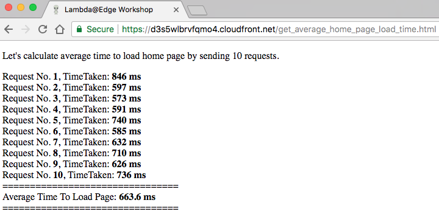
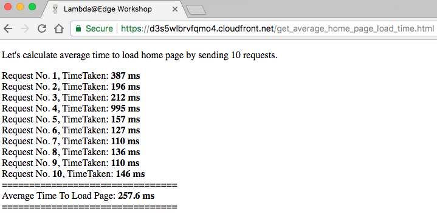

## Lab 7 - Global Tables

Amazon DynamoDB Global Tables provide a fully managed, multi-region, and multi-master database that provides fast, local, read and write performance for massively scaled, global applications. Global Tables replicates your Amazon DynamoDB tables automatically across your choice of AWS regions. With Global Tables, one can create tables in multiple regions and use Lambda@Edge to read/write data from DynamoDB table in a nearer region to create highly performant serverless website having global userbase.

**NOTE:** Here and below throughout the workshop, replace the example domain name `d123.cloudfront.net` with the unique name of your distribution.

As part of CloudFormation stack creation, DynamoDB global tables were created in "EU (Frakfurt) and US West (Oregon)". Currently homepage card details are being read from DynamoDB table in "EU (Frakfurt)" region.

As part of this lab, you will modify an existing lambda function `ws-lambda-at-edge-generate-home-page.js` to inspect `CloudFront-Viewer-Country` header, set by Cloudfront, to find the country of the viewer and if the viewer is located in United States or Canada, DynamoDB region is updated to "US West (Oregon)". On completion of this lab, depending upon viewer country of the users of this lab, average homepage load time might change. For users in US and Canada, since "US West (Oregon)" is nearer than "EU (Frakfurt)", the average homepage load time should be considerably lesser.

#### 1 Modify cache behavior for homepage path pattern

To calculate average homepage load time while reading card details from "EU (Frakfurt)" region, update existing cache behaviour with Path Pattern `/index.html` to set TTL to 0. On setting TTL to 0, Cloudfront doesn't cache objects and the request is always sent to origin.

Jump to Cloudfront console, click on distribution ID and under `Behaviors` tab, select entry with Path Pattern `/index.html`, click "Edit" and update the following settings:
* `Object Caching`: `Customize`
* `Minimum TTL`: `0`
* `Maximum TTL`: `0`
* `Default TTL`: `0`

Click `Yes, Edit`

<kbd></kbd>

<kbd></kbd>

#### 2 Calculate time taken to fetch an image from an S3 origin

Open [https://d123.cloudfront.net/get_average_home_page_load_time.html](https://d123.cloudfront.net/get_average_home_page_load_time.html) to send few requests to generate content for homepage by reading card details from DynamoDB table in "EU (Frankfurt)" region and calculate the average homepage load time. Make a note of this resultant time.

<kbd></kbd>

#### 3 Modify a Lambda function

Modify an existing Lambda function `ws-lambda-at-edge-generate-home-page.js` in "US East (N.Virginia)" region.

Use JavaScript code from [ws-lambda-at-edge-select-nearer-origin.js](./ws-lambda-at-edge-select-nearer-origin.js) as a blueprint. 

Take a moment to familiarize yourself with the function code and what it does. You will need to replace FIXME with relevant details.

This basically updates the exisiting function to inspect for `CloudFront-Viewer-Country` request header, and if country belongs to US or CA, DynamoDB client region is updated to "US West (Oregon)".

<kbd></kbd>

#### 4 Validate the function works in Lambda Console

Click `Save` and then `Test` and configure the test event. Create new test event and use [ws-lambda-at-edge-generate-home-page-test-input.json](./ws-lambda-at-edge-generate-home-page-test-input.json) as a test input.

<kbd></kbd>

Execute the test-invoke and validate that function has returned `200` status code and the `body` field contains a meaningful HTML document.

<kbd></kbd>

#### 5 Publish a function version

Choose "Publish new version" under "Actions", specify an optional description of a function version and click "Publish".

<kbd></kbd>

#### 6 Update cache behavior for homepage path pattern 

Jump to Cloudfront console and under the "Behaviors" tab, select entry with Path Pattern `/index.html`, click "Edit" and update following settings:
* `Cache Based on Selected Request Headers`: `Whitelist`
* `Whitelist Headers`: Select `CloudFront-Viewer-Country` and click `Add >>`
* `Lambda Function Associations`: `Origin Request` = `<lambda version ARN from the previous step>`

Click `Yes, Edit`

<kbd></kbd>

<kbd></kbd>

#### 7 Wait for the change to propagate

Wait for ~30-60 seconds for the change to propagate and for the Lambda function to get globally replicated.

#### 8 Verify change in average homepage load time

Again open [https://d123.cloudfront.net/get_average_home_page_load_time.html](https://d123.cloudfront.net/get_average_home_page_load_time.html) to send few requests to generate content for homepage by reading card details from DynamoDB table in region nearer to country of the viewer and calculate the average homepage load time. For users in US and CA, the average load time should now be considerably lesser as compared against fetching card details from DynamoDB table in "EU (Frakfurt)" region.

<kbd></kbd>

#### 9 Update cache behavior to allow object caching

In step 1, we had disabled object caching for homepage content generation by setting TTL to 0 to demonstrate how DynamoDB global table and Lambda@Edge can further reduce latencies based on `CloudFront-Viewer-Country` header. Let's change back the TTL setting to default so as to enable object caching again.

Jump to Cloudfront console and under the "Behaviors" tab, select entry with Path Pattern `/index.html`, click "Edit" and update following settings:
* `Object Caching`: `Custommize`
* `Minimum TTL`: `0`
* `Maximum TTL`: `5`
* `Default TTL`: `5`

Click `Yes, Edit`

<kbd></kbd>